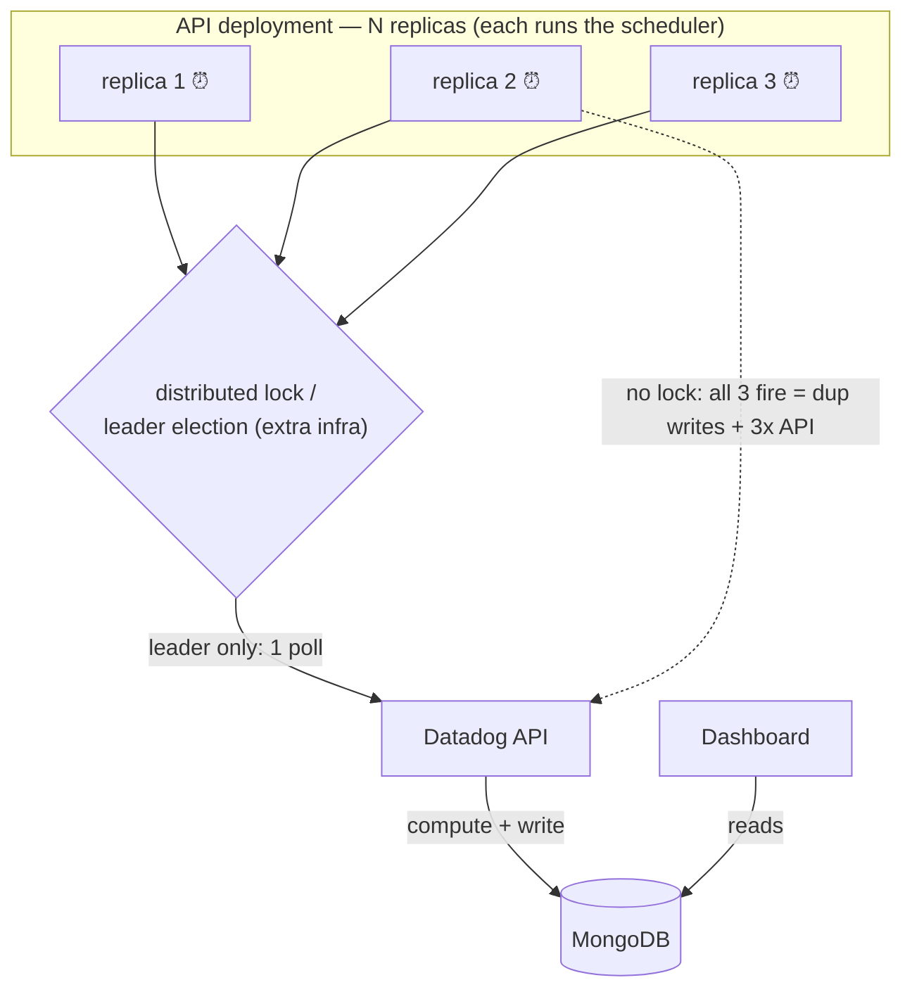
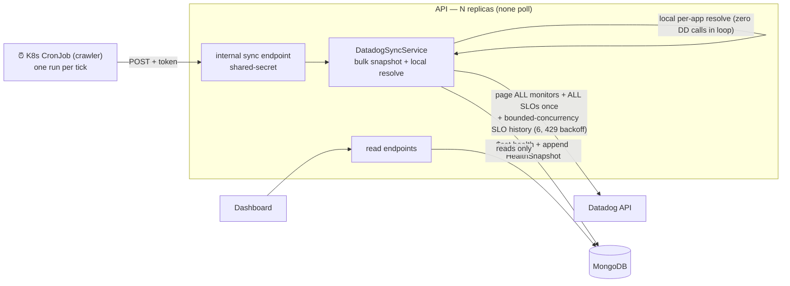
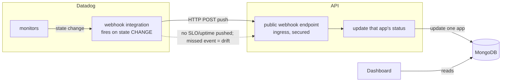

# ADR-001 — Datadog → Dashboard ingestion pattern

- **Status:** Accepted — Option B implemented (sync logic + internal endpoint live on
  `feature/datadog-live-health`; CronJob auto-trigger built but held pending validation)
- **Date:** 2026-06-15 (updated 2026-06-16)
- **Decision driver:** how to get Datadog health (monitor state, uptime, error budget) into the
  dashboard's own database, for the Phase-1 live-Health signal.

---

## Context

The Operational Dashboard shows per-app **Health** (green/amber/red) derived from Datadog
**monitors + SLOs**. We need a mechanism to pull that telemetry from Datadog (SaaS) and store a
computed rollup in our own **MongoDB**, which the dashboard reads.

**Constraints that shape the decision:**

- The API (NestJS) runs on **Kubernetes in multiple replicas**.
- The dashboard must **read only from Mongo** (decoupled — Datadog latency/outage must not affect
  it).
- Datadog is SaaS with **API rate limits** and **~2-week retention**; **no RUM license**.
- Freshness target is **minutes** (every 5–15 min), not real-time.
- We need a **periodic full snapshot** of every app (status + uptime + error budget), not just
  change events.

**Evaluation criteria:** replica-safety, full-snapshot capability, freshness, Datadog API pressure,
reliability/backfill/self-heal, operational complexity, platform fit.

---

## The three proposals

### Option A — In-process scheduled poller (cron inside the API)

A scheduled task (e.g. `@nestjs/schedule`) inside the existing API polls Datadog every N minutes and
writes Mongo.

- **Pros:** zero new deployable; simplest to write; reuses the API's DI, config, and Datadog client.
- **Cons:** the API runs in **multiple replicas → every replica fires the poll** → duplicate
  concurrent writes and N× Datadog API calls. Fixing it requires **leader election / a distributed
  lock** (ShedLock-style on Mongo, or a leader-elect sidecar) — extra complexity and a new failure
  mode. Also couples ingestion to the API's deploys/scaling.
- **Best when:** single-replica services, or teams that already run distributed-lock infra and want
  to avoid a separate deployable.

### Option B — Kubernetes CronJob "the crawler" ✅ _(recommended)_

A tiny standalone job, scheduled by Kubernetes (Helm cronjob), calls **one internal API endpoint**
that runs the sync; the API computes health and writes Mongo; the dashboard reads only Mongo.

- **Pros:** **replica-safe by construction** (exactly one run per tick via
  `concurrencyPolicy: Forbid`); **decoupled** (Datadog problems never touch the dashboard — it
  degrades to stale, not broken); **native to our K8s / unified pipeline** (reuses an existing
  scheduler pattern); tiny image; trivial retries (`restartPolicy: OnFailure`); **low Datadog API
  pressure**; the crawler holds **no Datadog credentials** (only the API does).
- **Cons:** one more deployable to operate (a single Helm chart); not real-time (minutes —
  acceptable here); each tick re-snapshots the whole portfolio (one bulk fetch of all monitors +
  relevant SLOs, then a purely local per-app resolve — see **As-built** below).
- **Best when:** K8s-native, multi-replica, periodic full-snapshot needs, minutes-fresh — **i.e.
  exactly our situation.**

### Option C — Event-driven (Datadog webhooks push)

Configure Datadog to POST a webhook to our API when a monitor changes state; we update that app's
health on the event.

- **Pros:** near-real-time; **lowest** Datadog API pressure (no polling); no scheduler to run.
- **Cons:** webhooks fire only on **state changes of alerts/monitors** — there is **no periodic full
  snapshot, and SLO uptime / error budget are not pushed**; missed/failed webhooks → **drift** (no
  self-heal without a reconciliation poll); requires a **publicly reachable, secured ingress**
  endpoint; harder to initialize/backfill state.
- **Best when:** you need **instant** reaction to a monitor going red (alerting/incident automation)
  — and even then, best used **alongside** a poller, not instead of it.

---

## Comparison

| Criterion                                               |     A — In-process cron      | **B — CronJob "crawler"** |     C — Datadog webhooks     |
| ------------------------------------------------------- | :--------------------------: | :-----------------------: | :--------------------------: |
| Replica-safe without extra infra                        |   ❌ needs leader election   |    ✅ by construction     |              ✅              |
| Full periodic snapshot (status + uptime + error budget) |              ✅              |            ✅             |    ❌ deltas only, no SLO    |
| Freshness                                               |           minutes            |          minutes          |        near real-time        |
| Low Datadog API pressure                                | ❌ n× replicas unless locked |            ✅             |          ✅ lowest           |
| Reliability / backfill / self-heal                      |              ⚠️              |  ✅ next poll self-heals  |    ❌ missed events drift    |
| Operational complexity                                  |   ⚠️ lock infra + coupling   |     ✅ one Helm cron      | ⚠️ public ingress + security |
| Platform fit (K8s / unified pipeline)                   |              ✅              | ✅ native, reuses pattern |              ⚠️              |

---

## Decision: **Option B — the CronJob "crawler"**

It is the only option that is **replica-safe without extra coordination infra**, produces the **full
periodic snapshot we actually render** (status + uptime + error budget for every app), keeps the
dashboard **resilient via decoupling**, and is **native to our platform**. Option A's
leader-election machinery buys nothing a cronjob doesn't already give us for free; Option C cannot
produce the snapshot we display and would need a poller anyway for reconciliation.

It also **matches the direction the team already leaned toward** in the touch-point (reusing the
prior cronjob/"crawler" scheduler pattern) — so this executes the agreed approach rather than
introducing a contentious one.

**Industry corroboration:** internal developer portals / service catalogs (Backstage, Cortex,
OpsLevel, Port) that ingest Datadog monitors/SLOs for health rollups all **pull on a schedule** —
scheduled polling is the established pattern for this job. _(Note 2026-06-16: formal citations from
deep-research run wf_9d6d4452-53b were not retrieved into this repo; left as an explicit follow-up
rather than fabricating references. The decision does not rest on them — it is corroborated by the
live as-built result below.)_

---

## As-built (2026-06-16) — validated live, supersedes the per-app rationale

The decision (Option B) stands. Two things in the _rationale above_ described an early model that
was implemented, hit limits, and was replaced — recorded here so the diagram/cons don't mislead:

- **Ingestion is a BULK-FETCH snapshot, not a per-app fetch.** Each sync does **one bulk snapshot**:
  paginate **all** monitors + **all** relevant SLOs once, then resolve per-kept-SLO history under
  **bounded concurrency (6)** with **429 backoff** (honoring `Retry-After` / `x-ratelimit-reset`).
  Per-app resolution is then **purely local — zero Datadog HTTP inside the per-app loop**. This
  **replaced** an earlier per-app model (~1 monitor + 1 SLO + 3 history calls _per app_) that
  **tripped Datadog 429 rate limits** at portfolio scale. Earlier "rate-limit risk: low at MVP
  scale" language is obsolete — at real scale the per-app loop was the bottleneck, and the
  bulk-snapshot redesign is what makes the pattern viable.
- **Live result:** **651 apps mapped, 0 errors, ~157s, across 3656 apps** (not "12 seed apps"). One
  bulk snapshot per tick comfortably stays within Datadog limits.
- **The bridge is `app_short_key` (primary) / `app_service_id` (fallback).** The Datadog tag
  `app_short_key` == PlanView CAST key (== app `shortCode`) is the primary per-app identifier; the
  fallback is tag `app_service_id` == PlanView ServiceNow key (`SNSVC#######`). A coverage probe
  proved these are the **only** reliable per-app bridges (`service` / `business_unit` / `team` /
  `servicenow_chg` are **not**). Confirmed live in the Raja demo: `app_short_key` resolves; the
  ServiceNow key is often null, hence the `app_service_id` fallback. Health rollup: monitor
  `overall_state` worst-state-wins (Alert→RED, Warn/No Data→AMBER, OK→GREEN); uptime + error budget
  from SLO history; an app matching no monitors is `unmapped`→AMBER (never a false green).
- **What shipped vs held:** the sync logic + the internal token-guarded endpoint **POST
  `/api/v1/internal/sync/datadog`** live in `apps/api` and are **done/validated** (committed on
  `feature/datadog-live-health`, commit `fc8f6da`). The separate `apps/crawler` K8s **CronJob
  auto-trigger is BUILT but held out of the commit/branch** pending Bernardo's validation that a
  CronJob is the right trigger — so the **decision is implemented**, only the auto-trigger wiring
  awaits sign-off.

## Consequences / follow-ups

- ~~Validate the real Datadog SLO/history parsing against a live API response once credentials
  arrive (the mock client drives the PoC today).~~ **RESOLVED 2026-06-16:** validated live against
  the real Datadog API — 651/3656 apps mapped, 0 errors, ~157s; SLO/history parsing confirmed.
- Tune the sync interval after observing load (start at 5–15 min); one bulk snapshot ≈ 157s, so a
  sub-5-min cadence is unnecessary.
- Confirm single-vs-multi Datadog org topology (affects the crawler's reach).
- **Held pending Bernardo:** confirm a K8s CronJob is the right auto-trigger before merging
  `apps/crawler`. Until then the sync runs via the internal endpoint
  (`POST /api/v1/internal/sync/datadog`).
- **Future hybrid:** add Datadog **webhooks alongside** the crawler if instant reaction to a monitor
  going red becomes a requirement — the crawler stays the source of the full snapshot; webhooks add
  low-latency alerts.
